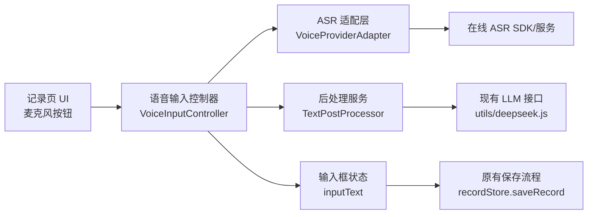

# miniRecord 安卓语音输入功能架构设计

## 1. 文档目标

为当前 uni-app 项目增加“语音输入（语音转文字）”能力，优先满足记录页高频输入场景：

- 一键开始/停止录音识别
- 边说边出字（增量结果）
- 识别结果可编辑，继续沿用原有“保存记录”流程
- 网络异常、权限拒绝、识别失败时有明确降级路径

本设计先覆盖 Android App 端，不改变现有周总结能力和数据结构。

## 2. 现状与约束

基于现有代码，语音输入设计需遵循以下约束：

- 技术栈：Vue 3 + uni-app + Pinia。
- 记录页面主入口：`pages/record/list.vue`。
- 数据持久化：本地存储（`utils/storage.js`）。
- 现有 AI 接入：周总结通过兼容 OpenAI 的 chat/completions 接口调用（`utils/deepseek.js`）。
- 配置规范：采用 `config.example.js` + 本地 `config.js` 模式，发布前执行 `npm run release:check`。
- 日志规范：优先使用 `utils/logger.js`，生产环境避免直接 `console.log`。

## 3. 术语澄清

- ASR / STT：Automatic Speech Recognition / Speech-to-Text，语音转文字（本需求核心）。
- TTS：Text-to-Speech，文字转语音（非本需求）。
- LLM 后处理：对 ASR 文本做纠错、标点、结构化，不承担主识别。

## 4. 方案选型

### 4.1 候选方案对比

1. 在线 ASR（流式）+ 可选 LLM 后处理（推荐）
2. 纯离线 ASR
3. 直接用语音多模态大模型做实时听写

对比结论：

- 准确率：在线 ASR 通常最优，中文口语场景成熟。
- 延迟：在线流式可做到实时增量；多模态大模型实时体验通常更差。
- 成本：在线 ASR 按时长可控；多模态大模型成本通常更高。
- 工程复杂度：在线 ASR 中等；离线 ASR 高（模型包体、端侧性能、机型兼容）。
- 离线可用：仅离线 ASR具备明显优势。

### 4.2 最终决策

采用“双层架构”：

- 主链路：在线流式 ASR 负责实时转写。
- 增强链路：LLM 后处理（可开关）负责标点修复、语义纠错。
- 降级策略：网络不可用时回退到手动输入；后续版本可扩展离线短句 ASR。

## 5. 总体架构



设计原则：

- UI 与 ASR SDK 解耦：通过适配层屏蔽具体供应商。
- 语音能力可插拔：后续可新增离线实现，不影响页面层。
- 不侵入现有存储模型：最终仍保存纯文本记录。

## 6. 模块设计

### 6.1 页面层（记录页）

在记录输入区域新增：

- 麦克风按钮：开始/停止语音输入。
- 状态提示：未开始、识别中、已停止、失败。
- 增量文本注入：识别中把中间结果实时拼接到 `inputText`。

交互要求：

- 用户可随时手动编辑文本。
- 语音结果与手动输入融合，停止后不强制覆盖。
- 若触发 200 字上限，超出部分自动截断并提示。

### 6.2 业务控制层（VoiceInputController）

职责：

- 管理状态机（Idle/Listening/Processing/Completed/Error）。
- 串联权限、ASR 生命周期、超时控制、错误映射。
- 向页面发出标准事件：`onPartial`、`onFinal`、`onError`、`onStateChange`。

关键策略：

- 单实例互斥：同一时刻仅允许一个识别会话。
- 自动停止：超过最长录音时长（例如 60 秒）自动结束。
- 静音截止：连续静音 N 秒（例如 3 秒）触发自动停止。

### 6.3 语音引擎适配层（VoiceProviderAdapter）

统一接口建议：

```ts
interface VoiceProviderAdapter {
  init(config: Record<string, any>): Promise<void>
  start(): Promise<void>
  stop(): Promise<void>
  cancel(): Promise<void>
  destroy(): Promise<void>
  on(event: 'partial' | 'final' | 'error' | 'volume', cb: (payload: any) => void): void
}
```

实现策略：

- 第一阶段仅实现 `CloudAsrAdapter`（在线）。
- 预留 `OfflineAsrAdapter` 接口位置（不在本期交付）。

### 6.4 文本后处理层（TextPostProcessor）

处理目标：

- 标点补全（可选）。
- 常见口语修正（可选）。
- 简单格式化（去除重复词、空白规范化）。

原则：

- 后处理失败不影响主流程，直接回落 ASR 原文。
- 后处理应设置较短超时（例如 3 秒），避免阻塞输入体验。

## 7. 配置与密钥管理

新增配置建议（示例放入 `config.example.js`，真实值放本地 `config.js`）：

```js
voice: {
  enabled: true,
  provider: 'cloud_asr',
  asrBaseURL: '',
  asrApiKey: '',
  asrModel: 'general',
  useLlmPostProcess: true,
  maxDurationSec: 60,
  silenceTimeoutSec: 3
}
```

安全要求：

- 严禁把真实 `asrApiKey` 提交到仓库。
- 发布前继续执行 `npm run release:check`。

## 8. 权限与隐私

### 8.1 Android 权限

- `RECORD_AUDIO`：语音采集必需。
- 首次触发时申请权限，被拒绝后给出明确引导（去系统设置开启）。

### 8.2 隐私策略

- 首次使用语音输入前展示告知：音频将发送到第三方识别服务（若启用在线 ASR）。
- 支持用户在设置中关闭语音输入能力。
- 默认不持久化原始音频，只保留最终文本。

## 9. 数据设计

### 9.1 记录数据

不修改 `daily_records` 主结构，仍保存文本内容。

### 9.2 新增本地存储键（建议）

- `voice_enabled`
- `voice_provider`
- `voice_use_llm_postprocess`
- `voice_privacy_ack`
- `voice_last_error`

以上均为轻量配置，便于设置页持久化。

## 10. 错误模型与降级策略

错误分类：

1. 权限错误：未授权录音。
2. 网络错误：ASR 请求超时或断网。
3. 服务错误：鉴权失败、配额不足、服务端异常。
4. 客户端错误：SDK 初始化失败、会话冲突。

降级规则：

- 任一错误都不影响手动输入和保存功能。
- 识别失败时保留已识别的中间文本（若有）。
- 对用户展示可执行提示，不暴露内部错误堆栈。

## 11. 性能与体验指标

目标指标（Android 中端机）：

- 首包初始化：< 800ms。
- 首字延迟（开始说话到首条 partial）：< 1200ms。
- 完整短句（5-8 秒）最终结果返回：< 2500ms（停说后）。
- 识别成功率（普通话、安静环境）：>= 95%。

体验细节：

- 录音中显示音量波动（可选）。
- 支持按下说话和点击切换两种交互（二期可加）。
- 避免频繁弹窗，优先使用轻提示。

## 12. 开发实施计划

### 里程碑 M1：最小可用（建议 3-4 天）

1. 记录页接入麦克风按钮与状态显示。
2. 接入在线 ASR 适配层（单一供应商）。
3. 识别结果写入输入框并可保存。
4. 权限申请、失败提示、超时停止。

### 里程碑 M2：可运营版本（建议 2-3 天）

1. 设置页增加语音配置开关。
2. 增加 LLM 后处理开关与超时保护。
3. 完善埋点与日志（按现有 logger 规范）。
4. 回归测试与稳定性验证。

## 13. 测试与验收

### 13.1 功能验收

1. 首次点击麦克风能正确申请权限。
2. 说话时输入框实时出现增量文本。
3. 停止后生成最终文本，用户可继续编辑并保存。
4. 无网、拒绝权限、接口错误时能正常降级到手动输入。

### 13.2 兼容性验收

1. Android 8-14 主流机型可用。
2. 应用切后台再回前台，会话状态可恢复或安全终止。
3. 横竖屏切换（如支持）不导致会话泄漏。

### 13.3 安全验收

1. 仓库中无真实语音服务密钥。
2. `release:check` 通过。
3. 生产日志不输出敏感信息。

## 14. 风险与应对

1. 第三方 ASR 波动
   - 应对：增加超时、重试、供应商切换预案。
2. 噪音环境导致识别质量下降
   - 应对：提示用户靠近麦克风、后处理纠错。
3. 不同机型权限行为差异
   - 应对：完善权限异常分支和机型回归清单。

## 15. 结论

本项目语音输入建议采用“在线流式 ASR + 可选 LLM 后处理”的分层架构。该方案在准确率、实时性、成本和工程复杂度之间最平衡，并且可在不破坏现有记录与总结流程的前提下快速上线。

本设计文档确认后，可进入下一步：按 M1 实施最小可用版本。
